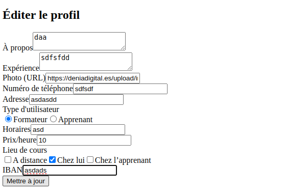

# README - Split Project

## Cahier des Charges Fonctionnel

**Version :** 1.1

**Description :** Documentation fonctionnelle de l'application Split.

---

### **Sommaire**

1. [Contexte](#contexte)
2. [Fonctionnalités](#fonctionnalités)
   - [Login](#login)
   - [Création d'un utilisateur](#création-d'un-utilisateur)
   - [Recherche](#recherche)
   - [Réserver un cours](#réserver-un-cours)
   - [Profil utilisateur](#profil-utilisateur)
3. [Base de Données](#base-de-données)
   - [Création](#création-de-la-base-de-données)
4. [Exécution de l'Application](#exécution-de-lapplication)
5. [Dépendances](#dépendances)


---

### **Contexte**
Split est une application de partage de compétences et d'expériences dans le domaine du digital, basée sur la méthode "reverse mentoring". Elle offre aux utilisateurs la possibilité d'acquérir ou de partager des compétences à travers des cours à faible coût ou rémunérés.

---

### **Fonctionnalités**

#### **Login (fonctionnel)**
- Connexion manuelle avec email et mot de passe.
- Gestion des erreurs (ex: email ou mot de passe incorrect).

#### **Création d'un utilisateur (fonctionnel)**
- Formulaire d'inscription avec des informations personnelles, une adresse email valide et l'acceptacion des conditions d'utilisation.

#### **Recherche (fonctionnel)**
- **Recherche avancée** : Affiner les recherches par domaine, ville ou catégories.
- **Recherche rapide** : Trouver rapidement des utilisateurs ou entreprises.

#### **Réserver un cours (partiellement fonctionnel) ** 
- Réservation via un calendrier interactif.
- Notifications pour confirmer ou rappeler les rendez-vous.

#### **Profil utilisateur (fonctionnel)**
- Afficher, éditer et supprimer le profil.
- Gérer les préférences comme les horaires, les lieux de cours, etc.

### **Base de Données**

#### **Création de la Base de Données**

1. Démarrer PostgreSQL : Assurez-vous que votre serveur PostgreSQL est en cours d'exécution.

2. Connexion au serveur :

```bash
psql -U postgres
```

3. Créer la base de données :

```sql
CREATE DATABASE mydatabase;
```

4. Se connecter à la base :

```bash
\c mydatabase
```

5. Créer les tables :

```sql
-- Table des utilisateurs
CREATE TABLE users (
    id SERIAL PRIMARY KEY,
    email VARCHAR(255) NOT NULL UNIQUE,
    password VARCHAR(255) NOT NULL,
    name VARCHAR(255) NOT NULL,
    surname VARCHAR(255) NOT NULL,
    about TEXT,
    experience TEXT,
    photo VARCHAR(255),
    phone VARCHAR(15),
    address VARCHAR(255),
    user_type VARCHAR(50) NOT NULL CHECK (user_type IN ('Formateur', 'Apprenant')),
    accept_terms BOOLEAN NOT NULL,
    schedule TEXT,
    price_per_hour NUMERIC(10, 2),
    course_location TEXT,
    iban VARCHAR(34),
    created_at TIMESTAMP DEFAULT CURRENT_TIMESTAMP
);

-- Table des cours
CREATE TABLE courses (
    id SERIAL PRIMARY KEY,
    title VARCHAR(255) NOT NULL,
    date DATE NOT NULL,
    time TIME NOT NULL,
    domaine VARCHAR(255),
    location VARCHAR(255) NOT NULL,
    instructor_id INTEGER NOT NULL REFERENCES users(id) ON DELETE CASCADE,
    student_id INTEGER REFERENCES users(id),
    created_at TIMESTAMP DEFAULT CURRENT_TIMESTAMP
);

-- Table des notifications
CREATE TABLE notifications (
    id SERIAL PRIMARY KEY,
    user_id INTEGER NOT NULL REFERENCES users(id) ON DELETE CASCADE,
    message TEXT NOT NULL,
    is_read BOOLEAN DEFAULT FALSE,
    created_at TIMESTAMP DEFAULT CURRENT_TIMESTAMP
);
```

### **Exécution de l'Application**

1. Installer les dépendances :

```bash
npm install
```

2. Démarrer le serveur backend :

```bash
node src/backend/index.js
```

3. Lancer l'application en local :

```bash
npm run dev
```

4. Accéder à l'application :

    Ouvrez votre navigateur et rendez-vous sur http://localhost:3000.

### **Dépendances**

    React
    Express
    PostgreSQL
    TailwindCSS
    Vite

### **Quelques fonctionnalités de l'application**

#### **Page d'accueil**


#### **Inscription**


#### **Connexion**


#### **Profil Utilisateur**


#### **Édition du Profil (Apprenant)**


#### **Édition du Profil (Formateur)**


#### **Créer un cours**


